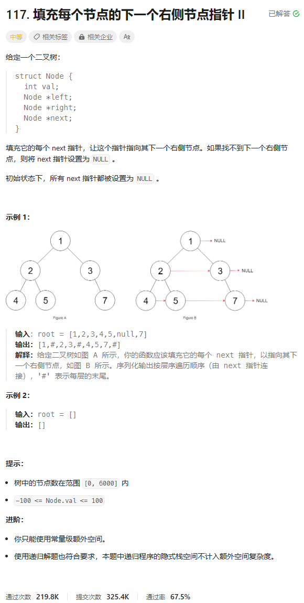

# 题目



# 我的题解

## 思路：


# 其他题解

## 其他1:BFS


```C++
/*
// Definition for a Node.
class Node {
public:
    int val;
    Node* left;
    Node* right;
    Node* next;

    Node() : val(0), left(NULL), right(NULL), next(NULL) {}

    Node(int _val) : val(_val), left(NULL), right(NULL), next(NULL) {}

    Node(int _val, Node* _left, Node* _right, Node* _next)
        : val(_val), left(_left), right(_right), next(_next) {}
};
*/

class Solution {
public:
    Node* connect(Node* root) {
        if (!root) {
            return root;
        }
        queue<Node*> q{{root}};
        while (!q.empty()) {
            Node* p = nullptr;
            for (int n = q.size(); n; --n) {
                Node* node = q.front();
                q.pop();
                if (p) {
                    p->next = node;
                }
                p = node;
                if (node->left) {
                    q.push(node->left);
                }
                if (node->right) {
                    q.push(node->right);
                }
            }
        }
        return root;
    }
};

```


# 其他2：BFS+空间优化


```C++
/*
// Definition for a Node.
class Node {
public:
    int val;
    Node* left;
    Node* right;
    Node* next;

    Node() : val(0), left(NULL), right(NULL), next(NULL) {}

    Node(int _val) : val(_val), left(NULL), right(NULL), next(NULL) {}

    Node(int _val, Node* _left, Node* _right, Node* _next)
        : val(_val), left(_left), right(_right), next(_next) {}
};
*/

class Solution {
public:
    Node* connect(Node* root) {
        Node* node = root;
        Node* prev = nullptr;
        Node* next = nullptr;
        auto modify = [&](Node* curr) {
            if (!curr) {
                return;
            }
            if (!next) {
                next = curr;
            }
            if (prev) {
                prev->next = curr;
            }
            prev = curr;
        };
        while (node) {
            prev = next = nullptr;
            while (node) {
                modify(node->left);
                modify(node->right);
                node = node->next;
            }
            node = next;
        }
        return root;
    }
};

作者：ylb
链接：https://leetcode.cn/problems/populating-next-right-pointers-in-each-node-ii/
来源：力扣（LeetCode）
著作权归作者所有。商业转载请联系作者获得授权，非商业转载请注明出处。
```

