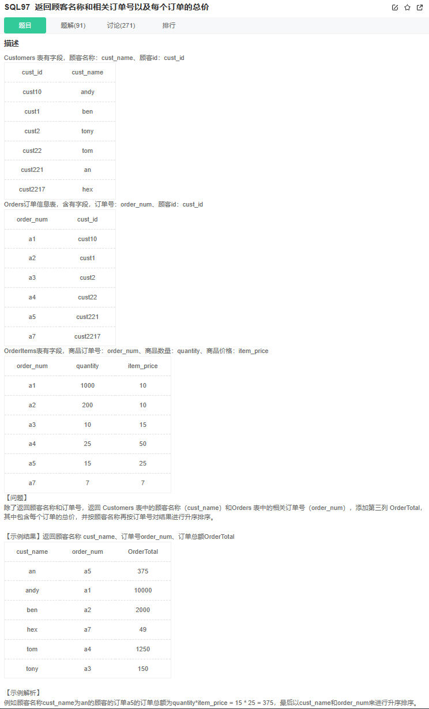

# 题目




# 我的题解

## 思路

一刷未做出


```sql

```


# 其他题解


## 题目分析

### 初步分析

**根据题目要求，我们需要输出：顾客名称、订单号、每个订单的总价（OrderTotal）**。根据这个输出，可以初步确定，我们需要三张表的联合查询。

订单总价OrderTotal计算：`sum(quantity*item_price)`

**条件：按顾客名称再按订单号对结果进行升序排序。**

题目给出了三个表格，分别为**顾客信息表：Customers 、订单信息表：Orders以及商品信息表OrderItems。**

### 进一步分析

我们怎么能让三张表关联起来？

**先让两张表之间相互关联。**

1. 先考虑顾客信息表：Customers 、订单信息表：Orders 通过两张表的字段，我们可以通过字段`cust_id`将两张表关联起来，**得到顾客名称**。
2. 订单信息表：Orders以及商品信息表OrderItems。 我们可以通过字段`order_num`关联起来，**算出每个订单的总价。**

现在，顾客名称有了，每个订单的总价也有了，订单号也能够得到，但是怎么输出呢？

别急，先将上面两步的SQL语句写出来，慢慢分析。

### SQL编写分析

**SQL1:计算每个订单的总价**

因为我们要计算的是每个订单的总价，所以要使用到`group by`函数对订单进行分组。不然求和的时候，计算的结果是所有的订单总价。

```sql
select order_num,sum(quantity*item_price) OrderTotal from OrderItems group by order_num;

```

我们发现，只要根据上面查询的结果，联合 **订单信息表：Orders**，我们就能查询每个订单对应的客户编号：cust_id

**SQL2:查出每个订单对应的用户id(cust_id)以及订单号**

```sql
select o.cust_id,t.order_num,t.OrderTotal from Orders o
join 
(select order_num,sum(quantity*item_price) OrderTotal from OrderItems group by order_num) t
on t.order_num=o.order_num;

```

现在，订单号有了，每个订单的总价也有了，就剩一个顾客的名称。我们可以利用cust_id,将cust_id替换成cust_name，我们的输出就满足题目要求了

**SQL3：再来一个连接查询，搞定**

```sql
select c.cust_name,t.order_num,t.OrderTotal from Orders o
join 
(select order_num,sum(quantity*item_price) OrderTotal from OrderItems group by order_num) t
on t.order_num=o.order_num
join Customers c
on c.cust_id=o.cust_id
order by c.cust_name,t.order_num;

```

## 进阶思路

在上面的代码中，我们在连接查询中，增加了一个子查询，从某种程度上说，降低了我们的查询速度。那么，上面的SQL语句有没有办法继续优化呢？答案是肯定的。

认真一想，其实我们的子查询其实是没有必要的。为什么呢？因为这个子查询查出来的字段，我们可以通过在外部再加一个连接查询可以解决。

```
(select order_num,sum(quantity*item_price) OrderTotal from OrderItems group by order_num) t
```

在这个子查询中，我们无非就是查出了一个订单编号和每一个订单的总价，并且利用这个子查询中的订单编号作为媒介，与订单信息表Orders 关联了起来。这看起来完全就是多余的。我们完全可以直接利用**商品的详细信息表OrderItems**、**订单信息表Orders**以及**顾客信息表Customers**，就能够获取到我们想要的顾客名称以及每个订单的总价。

具体的SQL语句优化后如下：

```sql
select c.cust_name,os.order_num,sum(os.quantity*os.item_price) OrderTotal from Orders o
join OrderItems os
on os.order_num=o.order_num
join Customers c
on c.cust_id=o.cust_id
group by c.cust_name,os.order_num
order by c.cust_name,os.order_num;

```

**大家可以思考一下，在优化后的SQL语句中，为什么我们有了两个分组条件？去掉cust_name这个分组条件。结果又会如何？欢迎大家在评论区中探讨。**

## 总结

这个题目主要考察的是多张表的联合查询，中间还穿插着子查询，所以我们自己要分析准确，不然也会被绕晕。做这种题目，主要是一步一步分析，先将简单的SQL语句写出来，再组合成复杂的语句，问题就很容易解决了。

最后，感谢大家阅读我的题解，如果大家有更好的解题思路，希望大家踊跃提出。文中若有什么错误，欢迎大家指正。如果这篇文章对大家有帮助，希望大家帮忙点个赞收藏一下，再次感谢大家。


