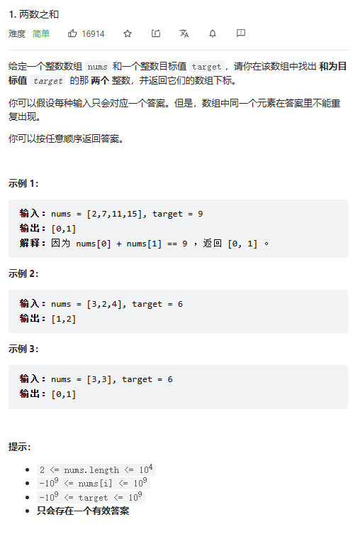

# 题目



# 我的题解

```C++
class Solution {
public:
    vector<int> twoSum(vector<int>& nums, int target) {
        //二分法
        for(int i=0;i<nums.size();i++){
            int target2=target-nums[i];
            int left=i+1,right=nums.size()-1;
            while(left<right){
                int mid=left+((right-left)>>1);
                if(nums[mid]>=target2){
                    right=mid;
                }
                else left=mid+1;
            }
            if(nums[left]==target2)return {i,left};
        }
        return {};
    }
};
```

错了