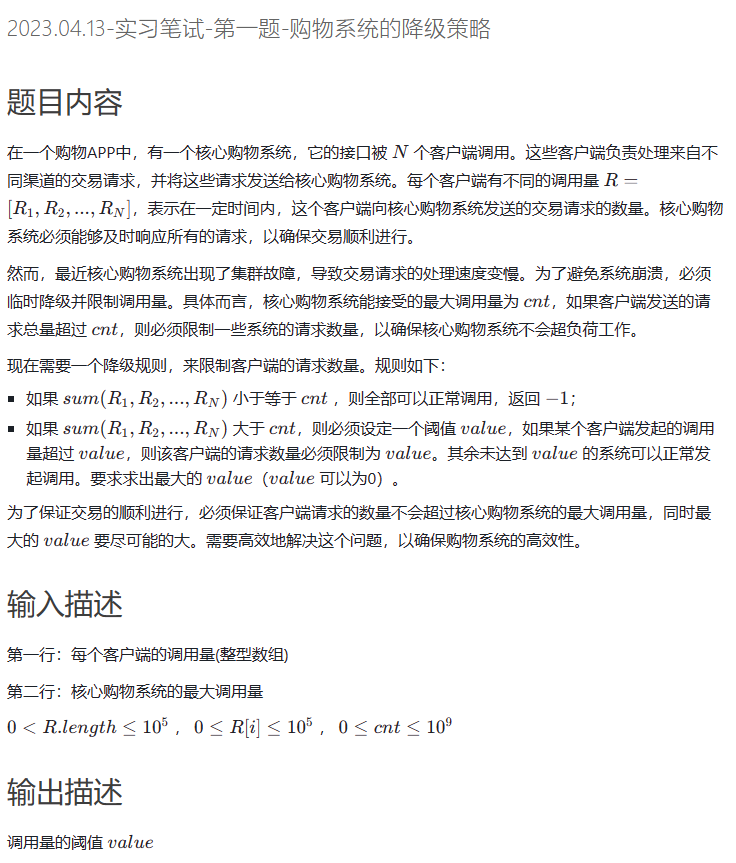
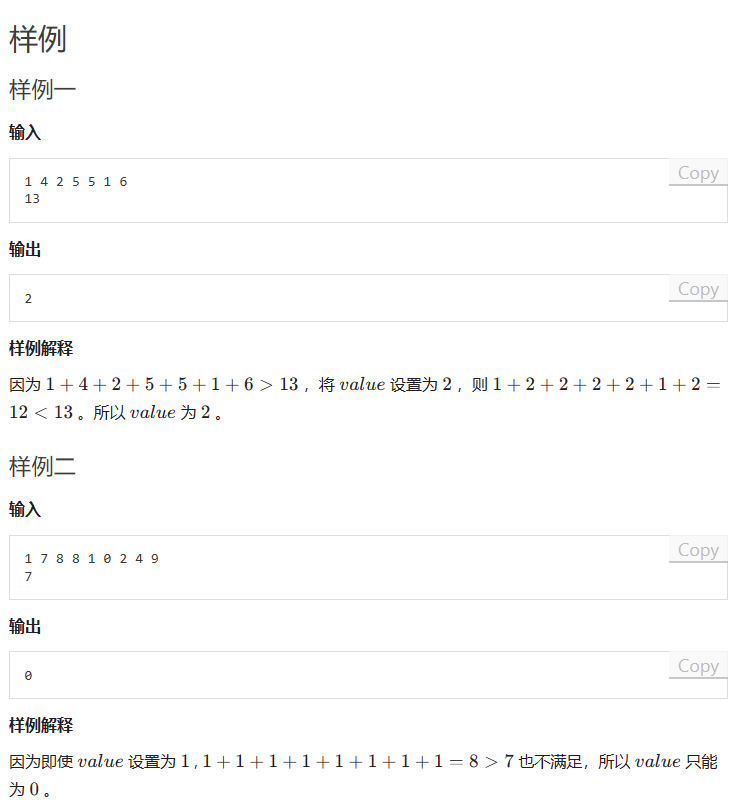
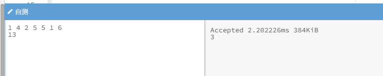
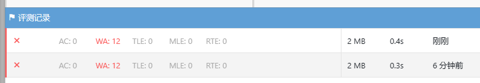
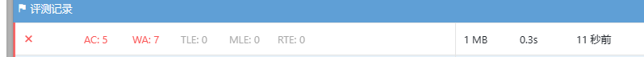
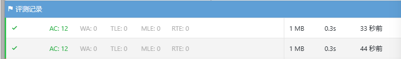

# 题目






# 我的题解

1.困难

如何在不知道读取多少个数量的情况下，读取第一行数据

然后再读取第二行数据

**那么就是全部读取出来，再处理最后一个**

别用while(cin>>w[n++])这样计算出来的n会多加1，因为多循环了一次，虽然条件不满足


思路：题目中要求求出最大value,但是不能超过最大调用量

那我们可以使用二分法，最大值是数组元素的最大值，最小值可以是0

然后通过check函数来判断这个value能否满足不超过核心购物系统的最大调用量

然后依据这个判断，来更新value


独立完成，错误

```cpp
#include<bits/stdc++.h>
using namespace std;

const int N=1e5+5;
int w[N],n,m,maxvalue;

bool check(int value){
    int sum=0;
    for(int i=0;i<n;i++){
        if(w[i]>value)sum+=value;
        else sum+=w[i];
    }
    return sum<=maxvalue?true:false;
}

int main(){
    
    while(cin>>m)w[n++]=m;
    maxvalue=w[n-1];
    n--;
    //for(int i=0;i<n;i++)cout<<w[i]<<" ";

    int left=0,right=*max_element(w,w+n);//w+n 指针 功能类似于end()
    
    while(left<right){
        int mid=left+ ((right-left)>>1);
        if(!check(mid)){//不满足条件,mid位于右半区，right减小
            right=mid;
        }
        else left=mid+1;
        //cout<<left<<" "<<right<<endl;
    }
    //int resvalue=left;
    cout<<left<<endl;

    return 0;
}
```





**为什么我从right=mid角度去写就是错的呢？**

思考一下


# 别人题解

```C++
#include <bits/stdc++.h>
using namespace std;
typedef pair<int,int>PII;
#define x first
#define y second
typedef long long ll;
const int N=1E5+10;
int n,w[N],x,cnt;
bool check(int x)
{
    ll sum=0;
    for(int i=0;i<n;i++)sum+=min(x,w[i]);
    return sum<=cnt;
}
int main()
{
    while(cin>>x)w[n++]=x;
    cnt=w[n-1];
    n--;
    int maxv=*max_element(w,w+n);
    int l=0,r=maxv;
    while(l<r)
    {
        int mid=l+r+1>>1;
        if(check(mid))l=mid;
        else r=mid-1;
    }
    if(r==maxv)puts("-1");
    else cout<<r<<endl;
    return 0;
}

```


这个题去年是出过几乎一模一样的题解的，我们的B站上出过视频讲解，有兴趣的同学可以去看看。

大体思路就是二分答案，这里涉及到二段性的分析，假设limit为x的时候是可以满足约束的，那么x-1的时候，必然也是满足的，因此这个属性是具有二段性的，所以可以对这个limit进行二分。

check()函数是判断当limit设置为x的时候，是否可以满足约束，这个函数的时间复杂度是O(n)。

二分的复杂度是O(log2n)，总体的复杂度是O(nlog2n)，针对1e5的数据规模是可以通过的。

```cpp
#include <iostream>
#include <vector>
using namespace std;

int cnt;
vector<int> R;

bool check(int x) {
    int res = 0;
    for (int r : R) {
        if (r <= x) res += r;
        else res += x;
    }
    return res <= cnt;
}

int main() {
    int temp;
    while (cin >> temp) R.push_back(temp);
    cin >> cnt;

    int l = 0, r = 1e5;
    while (l < r) {
        int mid = (l + r + 1) >> 1;
        if (check(mid)) l = mid;
        else r = mid - 1;
    }

    cout << r << endl;
    return 0;
}
```


# 修改原本代码

我的解法修改后

```cpp
#include<bits/stdc++.h>
using namespace std;

const int N=1e5+5;
int w[N],n,m,maxvalue;

bool check(int value){
    int sum=0;
    for(int i=0;i<n;i++){
        if(w[i]>value)sum+=value;
        else sum+=w[i];
    }
    return sum<=maxvalue?true:false;
}

int main(){
    
    while(cin>>m)w[n++]=m;
    maxvalue=w[n-1];
    n--;
    //for(int i=0;i<n;i++)cout<<w[i]<<" ";
    int maxv=*max_element(w,w+n);
    int left=0,right=maxv;//w+n 指针 功能类似于end()
    
    while(left<right){
        int mid=left+ ((right-left+1)>>1);
        if(check(mid)){//满足条件,mid位于左半区，target也可能位于左面也可能右面
            left=mid;
        }
        else right=mid-1;
        //cout<<left<<" "<<right<<endl;
    }
    //int resvalue=left;
    if(right==maxv)puts("-1");
    else cout<<left<<endl;

    return 0;
}
```




发现需要把sum改为long long

```cpp
#include<bits/stdc++.h>
using namespace std;

const int N=1e5+5;
int w[N],n,m,maxvalue;

bool check(int value){
    long long sum=0;
    for(int i=0;i<n;i++){
        if(w[i]>value)sum+=value;
        else sum+=w[i];
    }
    return sum<=maxvalue?true:false;
}

int main(){
    
    while(cin>>m)w[n++]=m;
    maxvalue=w[n-1];
    n--;
    //for(int i=0;i<n;i++)cout<<w[i]<<" ";
    int maxv=*max_element(w,w+n);
    int left=0,right=maxv;//w+n 指针 功能类似于end()
    
    while(left<right){
        int mid=left+ ((right-left+1)>>1);
        if(check(mid)){//满足条件,mid位于左半区，target也可能位于左面也可能右面
            left=mid;
        }
        else right=mid-1;
        //cout<<left<<" "<<right<<endl;
    }
    //int resvalue=left;
    if(right==maxv)puts("-1");
    else cout<<left<<endl;

    return 0;
}
```




