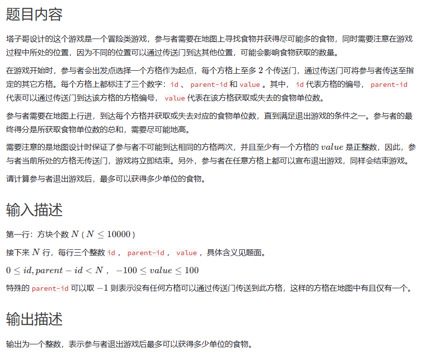
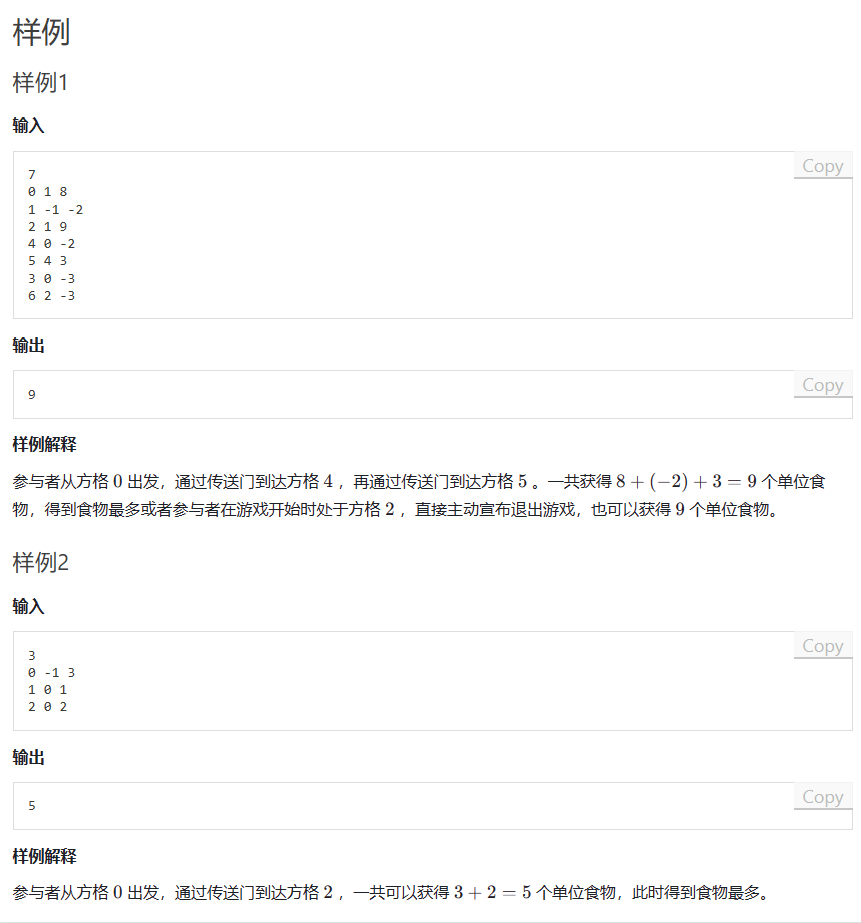

# 题目





# 我的题解

思路dfs遍历所有的路，但是需要存起来数值，并且需要知道每个方格与其他方格的关系

每个方格单独与另一个方格有联系，说明彼此之间构成一个通路

```cpp

```


# 其他题解

简单dfs f[u]定义为以u为终点的最大值

```cpp
#include <bits/stdc++.h>
using namespace std;
typedef pair<int,int>PII;
#define x first
#define y second
typedef long long ll;
const int N=1E5+10;
int n,w[N],f[N],st;
vector<vector<int>>g;
void dfs(int u,int sum)
{
    f[u]=max(f[u],w[u]+max(sum,0));
    for(int &x:g[u])
    {
        dfs(x,f[u]);
    }
}
int main()
{
    int a,b,c;
    cin>>n;
    g.resize(n);
    for(int i=0;i<n;i++)
    {
        cin>>a>>b>>c;
        w[a]=c;
        if(b==-1)
        {
            st=a;
            continue;
        }
        g[b].push_back(a);
    }
    memset(f,-0x3f,sizeof f);
    dfs(st,0);
    int res=INT_MIN;
    for(int i=0;i<n;i++)res=max(res,f[i]);
    cout<<res<<endl;
    return 0;
}

```


**思路与代码**

树形dp。

我们定义dp[i]表示以节点i结尾，可以获取的最大食物的数量。

对于dp[i]，我们的选择有走到父节点和不走到父节点，我们取最大的即可。也就是

**dp[i] = max(当前节点的食物，  当前节点的食物 +  dp[parent_id])**

我们需要把所有的dp[i]都枚举一次，最终复杂度为O(n)


```C++
#include <iostream>
#include <vector>
#include <algorithm>
using namespace std;

int n;
vector<vector<int>> nodes;
vector<int> dp;

int dfs(int i) {
    if (dp[i] != INT_MIN) return dp[i];
    if (nodes[i][0] == -1) return nodes[i][1];
    dp[i] = max(nodes[i][1], nodes[i][1] + dfs(nodes[i][0]));
    return dp[i];
}

int main() {
    cin >> n;
    nodes = vector<vector<int>>(n, vector<int>(2));
    for (int i = 0; i < n; i++) {
        int id, pid, val;
        cin >> id >> pid >> val;
        nodes[id][0] = pid;
        nodes[id][1] = val;
    }

    dp = vector<int>(n, INT_MIN);
    for (int i = 0; i < n; i++) {
        dfs(i);
    }

    cout << *max_element(dp.begin(), dp.end()) << endl;
    return 0;
}
```


