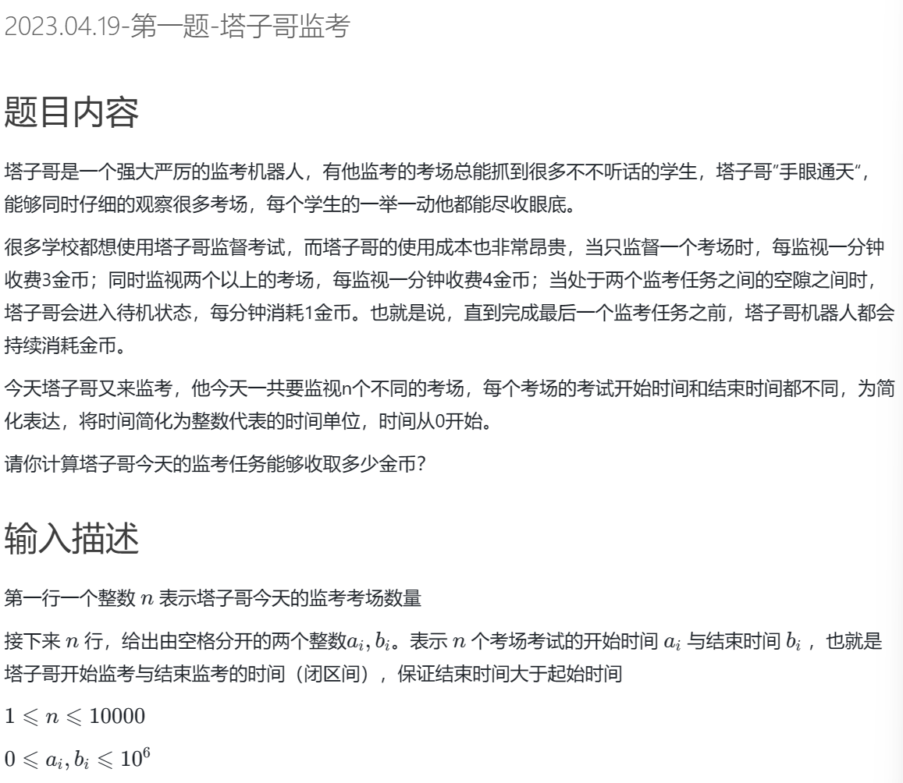
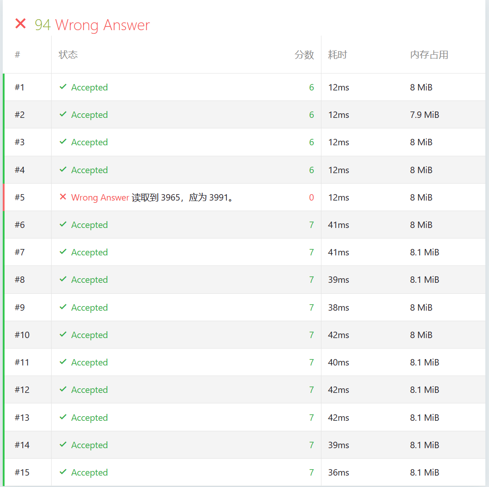
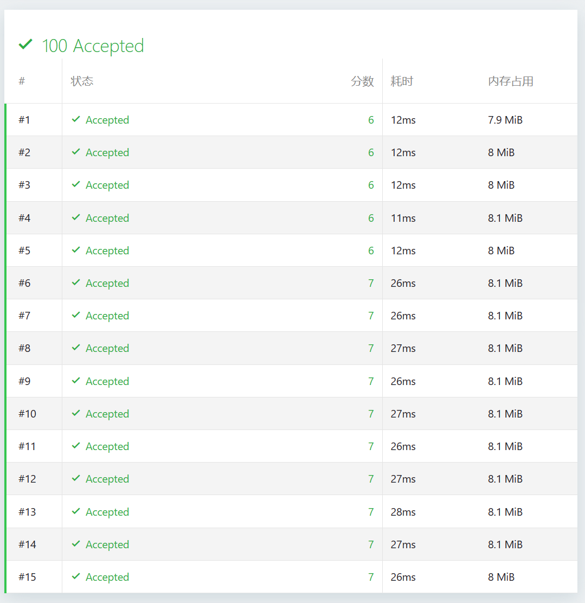

# 题目




# 我的题解

关键注意给出的前缀和（假想的前缀和）是从a[1],a[2]开始

而差分数组是从b[1],b[2]开始

即a[0]=0;

b[1]=a[1]-a[0];

b[n]=a[n]-a[n-1]

a的区间[l,r]+c 就是b[l]+c,b[r+1]-c

关键我们这里的区间[l,r]是指前缀和区间，而不是原来差分区间，并且差分区间也没有下标0，不要混淆


并且注意求区间大小，使用最大值 和 最小值的转化

```cpp
#include<bits/stdc++.h>
using namespace std;

//与传统的求差分数组的方式不一样，这道题要用区间最大值最小值来求

//其实与传统的根据前缀和数组（假想为），求差分数组一样
//因为一开始都是前缀和0，所以差分也是0
const int N=1e6+5;
vector<int> pre(N,0);
vector<int> diff(N,0);
int main(){ 
   int n;
   cin>>n;
   int max_val=INT_MIN;
   int min_val=INT_MAX;
   for(int i=0;i<n;i++){
        int l,r;
        cin>>l>>r;
        min_val=min(min_val,l);//记录总区间最小值
        max_val=max(max_val,r);//记录总区间最大值
        diff[l]+=1;
        diff[r+1]-=1;
   }
   int res=0;
    for(int i=1;i<=max_val;i++){
        pre[i]=pre[i-1]+diff[i];
        if(i>=min_val){
            if(pre[i]<1)
                res+=1;
            if(pre[i]==1)
                res+=3;
            if(pre[i]>=2)
                res+=4;
        }
    }
    cout<<res<<endl;
    return 0;
}
```


但是会有一个不通过，没想出来

改成这样能过，但是和我一开始的思想就有点区别了

pre[i+1]=pre[i]+diff[i];难道不应该是pre[i+1]=pre[i]+diff[i+1]吗

区间从0开始还是有点风险的

```cpp
#include<bits/stdc++.h>
using namespace std;

//与传统的求差分数组的方式不一样，这道题要用区间最大值最小值来求

//其实与传统的根据前缀和数组（假想为），求差分数组一样
//因为一开始都是前缀和0，所以差分也是0
const int N=1e6+5;
vector<int> pre(N,0);
vector<int> diff(N,0);
int main(){ 
   int n;
   cin>>n;
   int max_val=INT_MIN;
   int min_val=INT_MAX;
   for(int i=0;i<n;i++){
        int l,r;
        cin>>l>>r;
        min_val=min(min_val,l);//记录总区间最小值
        max_val=max(max_val,r);//记录总区间最大值
        diff[l]+=1;
        diff[r+1]-=1;
   }
   int res=0;
    for(int i=0;i<=max_val;i++){
        pre[i+1]=pre[i]+diff[i];
        if(i>=min_val){
            if(pre[i+1]==0)
                res+=1;
            if(pre[i+1]==1)
                res+=3;
            if(pre[i+1]>=2)
                res+=4;
        }
    }
    cout<<res<<endl;
    return 0;
}
```


# 其他题解


统计每个时间点的任务数量，时间片最长为1e6，可以考虑用数组存储每个时间点的任务数，使用差分数组实现对某个区间的快速增加1（任务数）.

```cpp
#include<bits/stdc++.h>
using namespace std;
const int N=1e6+5;
int counter[N];
int d_counter[N];
int main()
{
    int n;
    cin>>n;
    int min_val=INT_MAX,max_val=INT_MIN;
    for(int i=0;i<n;i++)
    {
        int a,b;
        cin>>a>>b;
        min_val=min(a,min_val);
        max_val=max(b,max_val);
        d_counter[a]+=1;
        d_counter[b+1]-=1;
    }
    int cur=0;
    int res=0;
    for(int i=0;i<=max_val;i++)
    {
        cur+=d_counter[i];
        if(i>=min_val)
        {
           if(cur==0)
              res+=1;
           if(cur==1)
              res+=3;
           if(cur>=2)
              res+=4;
        }
    }
    cout<<res;
    return 0;
}

```




