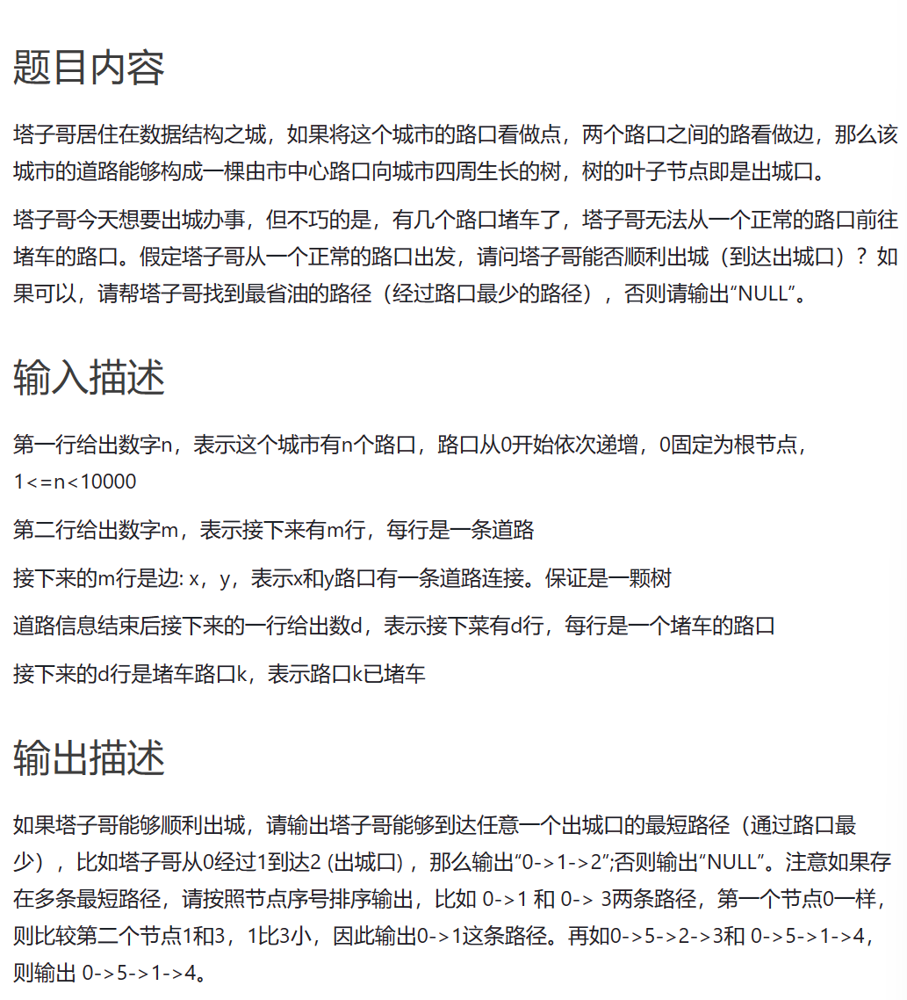
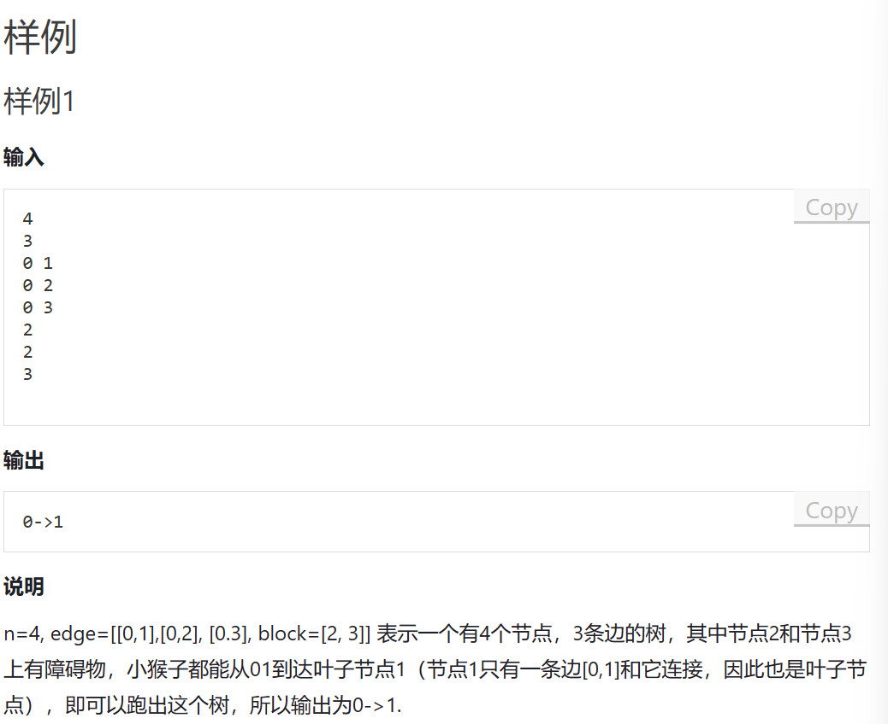
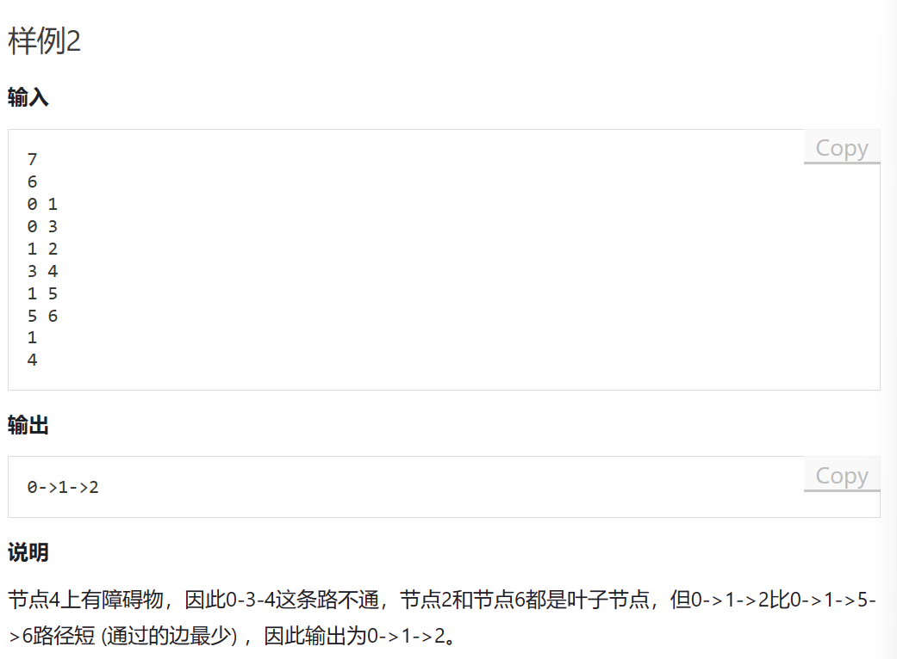

# 题目内容








# 我的题解


# 其他题解

这题还是适合BFS吧？DFS是得搜全部路径的啊。BFS搜到一条就ok了，最短路径肯定最早被搜到，搜到了就没必要往后搜了。多条一样的最短路径肯定是在同一层的，经过的路口数量是一样的。输出描述里有这样一句：**注意如果存在多条最短路径，请按照节点序号排序输出**，所以对同一层的节点需要搞个排序，同一层先搜序号较小的。

```cpp
#include <bits/stdc++.h>
using namespace std;
using ll = long long;
int main() {
	int n, m;
	cin >> n >> m;
	vector<vector<int>> tree(n);
	vector<int> fa(n);
	for (int i = 0; i < m; ++i) {
		int x, y;
		cin >> x >> y;
		tree[x].push_back(y);
		fa[y] = x;
	}
	int d;
	cin >> d;
	for (int i = 0; i < d; ++i) {
		int x;
		cin >> x;
		for (int& k : tree[fa[x]]) {
			if (k == x) k = -1;
		}
	}
	queue<int> Q;
	Q.push(0);
	int leave = -1;
	while (!Q.empty()) {
		if (leave != -1) break;
		int Qsize = Q.size();
		for (int i = 0; i < Qsize; i++) {
			int tmp = Q.front();
			Q.pop();
			sort(tree[tmp].begin(), tree[tmp].end());
			if (tree[tmp].empty()) {
				leave = tmp;
				break;
			}
			for (int j : tree[tmp]) {
				if (j != -1) Q.push(j);
			}
		}
	}
	if (leave == -1) cout << "NULL" << endl;
	else {
		string res;
		while (leave != 0) {
			res = "->" + to_string(leave) + res;
			leave = fa[leave];
		}
		res = "0" + res;
		cout << res << endl;
	}
	return 0;
}

```


```cpp
#include <algorithm>
#include <bits/stdc++.h>
#include <ctime>
#include <unordered_set>
#include <vector>

using namespace std;


int main(){
	int n, m, tmp;
	cin >> n >> m;
	vector<vector<int>> graph(n);

	// 记录最后的遍历路径
	vector<vector<int>> ans;

	// 记录堵车路口
	unordered_set<int> hash_set;

	for(int i = 0 ; i < m; i++){
		int x, y;
		cin >> x >> y;
		graph[x].push_back(y);
	}

    
	cin >> m;
	for(int i = 0; i < m; i++){
		int x;
		cin >> x;
		hash_set.insert(x);
	}

	vector<int> temp;
	temp.push_back(0);

	function<void(int)> dfs = [&](int index) -> void {
		if (graph[index].empty()) {
			ans.push_back(temp);
			return;
		}

		for (int i : graph[index]) {
			if (!hash_set.count(i)) {
				temp.push_back(i);
				dfs(i);
				temp.pop_back();
			}
		}
	};

	dfs(0);

	if (ans.size() == 0) {
		cout << "NULL";
		return 0;
	}

	// 遍历ans, 找出最短的路径
	sort(ans.begin(), ans.end(), [](vector<int> a, vector<int> b) -> bool {
		if (a.size() == b.size()) {
			for (int i = 0; i < a.size(); i++) {
				if (a[i] != b[i])
					return a[i] < b[i];
			}
		} else {
			return a.size() < b.size();
		}
	});

	for (int i = 0; i < ans[0].size(); i++) {
		if (i == ans[0].size() - 1) {
			cout << ans[0][i];
			break;
		}
		cout << ans[0][i] << "->";
	}

	return 0;

}

```


