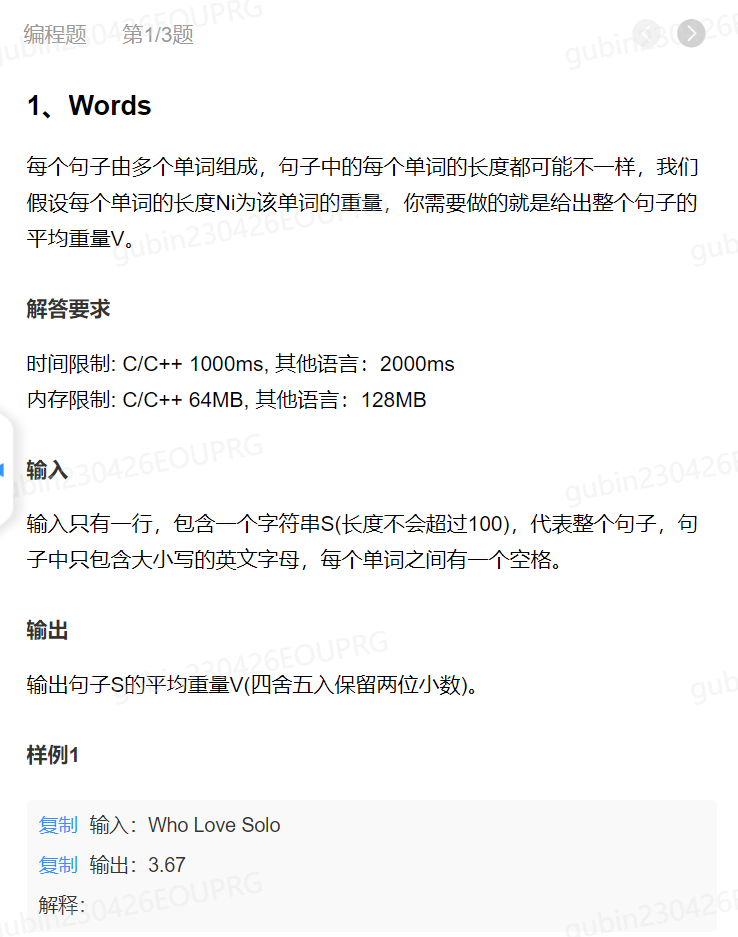
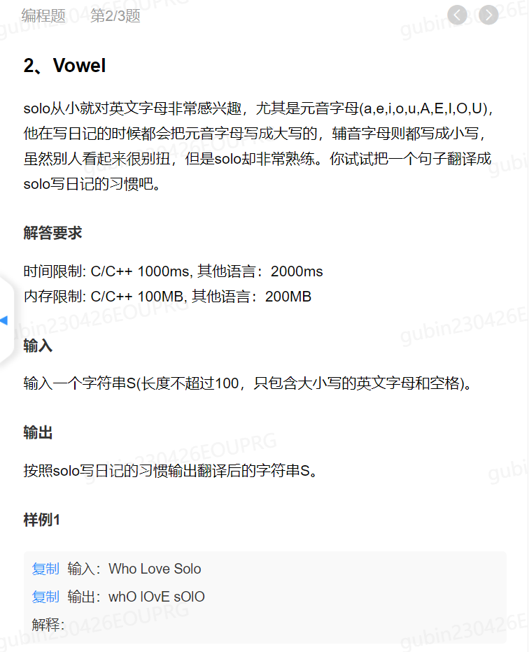
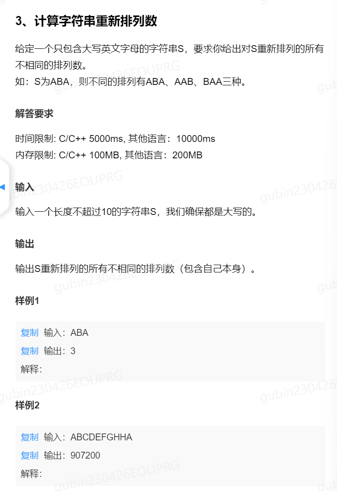

```cpp
#include<bits/stdc++.h>
using namespace std;

int main(){
    //getline(cin,str);
    string str;
    double sum=0;
    int length=0;
    for(int i=0;i<str.size();i++){
        if(str[i]!=' ')length++;
    }
    for(int j=0;j<str.size();j++)
    {	
        if(str[i]!=' ')
        double temp=sum/str.size();
        sum+=temp;
    }
    printf("%0.2lf",sum);
    return 0;
}
```




```cpp
#include<bits/stdc++.h>
int main()
{
    // please define the C++14 input here. For example: int a,b; cin>>a>>b;;
    // please finish the function body here.
    // please define the C++14 output here. For example:cout<<____<<endl;
    int p=0;
    vector<char> vec={'a','e','i','o','u'};
    vector<char> vec1={'A','E','I','O','U'};
    string str;
    while(cin>>str){
        if(p!=0)cout<<" ";
        for(int i=0;i<str.size();i++){
             if(find(vec.begin(),vec.end(),str[i])!=vec.end()||find(vec1.begin(),vec1.end(),str[i])!=vec1.end()){
                 str[i]=toupper(str[i]);
             }
             else {
                 str[i]=tolower(str[i]);
             }
            
        }
        cout<<str;
        p++;
    } 
    return 0;
}

```




```cpp
#include<bits/stdc++.h>
using namespace std;
vector<string> res;
string path;
void backtracking(string &str,vector<bool>&used){
    if(path.size()==str.size()){
        res.push_back(path);
        return;
    }
    for(int i=0;i<str.size();i++){
        /*
        if(used[i]==true){
            continue;
        }
        */
        if(i>0&&str[i]==str[i-1]&&used[i-1]==false){
            continue;
        }
        if(used[i]==false){
        path.push_back(str[i]);
        used[i]=true;
        backtracking(str,used);
        used[i]=false;
        path.pop_back();
        }
    }
    
}
int main()
{
    // please define the C++14 input here. For example: int a,b; cin>>a>>b;;
    // please finish the function body here.
    // please define the C++14 output here. For example:cout<<____<<endl;
	string str;
    cin>>str;
    sort(str.begin(),str.end());
    //cout<<str<<endl;
    vector<bool> used(str.size(),false);
    backtracking(str,used);
    cout<<res.size()<<endl;
    return 0;
}

```

