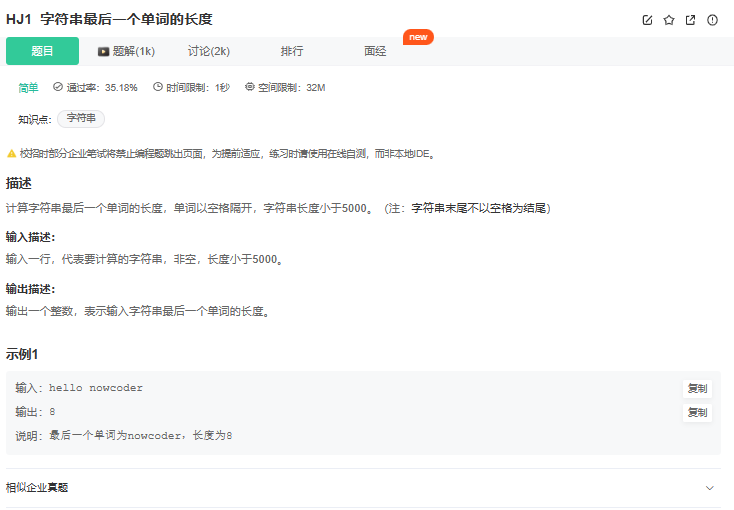

# 题目




# 我的答案

```C++
int main(){

    vector<string> vec;
    char buf[5000];
    while(scanf("%s",buf)!=EOF)
    {
        //char* 自动转化为string
        vec.push_back(buf);
    }
    int n=vec.size()-1;
    int res=vec[n].size();
    cout<<res<<endl;

    return 0;
}
```

## 注意点

### 1

牛客中读取字符串，如果有空格，那么就不能用定义string ,来直接cin,只能读取到一段

可以使用getline(cin,s)  

但是本题是读取很多字符串，中间用空格隔开，所以使用scanf("%s",buf)

并且使用循环 while(scanf("%s",buf)!=EOF),完成不断读取字符串


或者while(cin>>s)也能一直读取下去。


### 2

char* 字符串可以自动转为string 


其他解法

```C++
#include<bits/stdc++.h>

using namespace std;

int main() {
    string s;
    while(cin >> s);
    cout << s.size();
    return 0;
}
```

```C++
#include<iostream>
#include<string>
using namespace std;
int main()
{
    string str;
    getline(cin, str);
    int length = str.length();
    int tmp = -1;//记录位置
    for(int i=0; i<length; i++)
    {
        if(str[i] == ' ')
        {
            tmp = i;//记录倒数第一个空格位置
        }
    }

    cout<<length-tmp-1<<endl;
    return 0;
}
```

