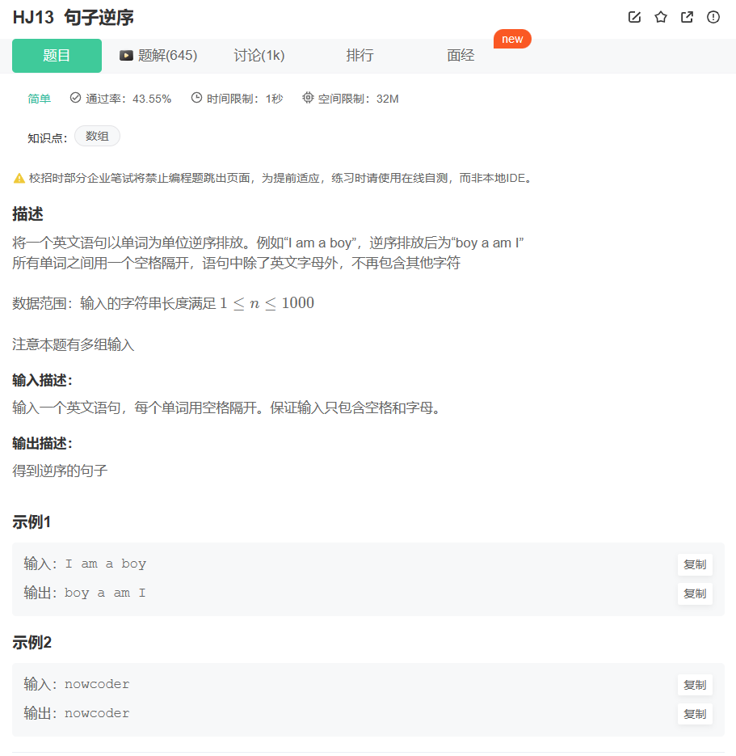
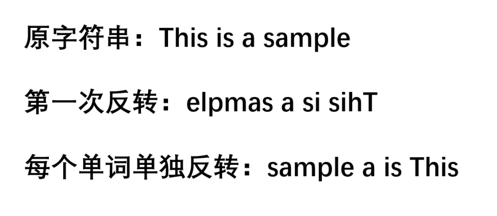
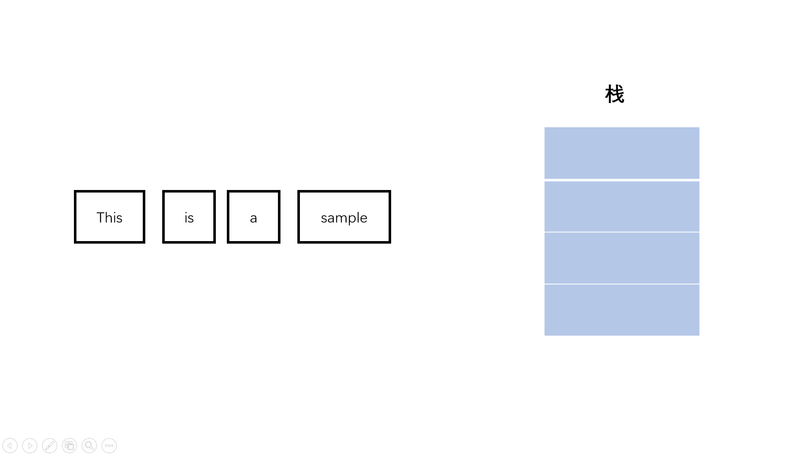

# 题目



# 我的题解

使用数组储存，然后倒序

使用双指针来切割字符串

```cpp
#include<iostream>
#include<vector>
using namespace std;

int main(){
    string str;
    getline(cin,str);
    int n=str.size();
    int j=0;
    vector<string> vec;
    for(int i=0;i<n;i++){
        if(str[i]==' '){
            string temp=str.substr(j,i-j);
            vec.push_back(temp);
            j=i+1;
        }
        if(i==n-1){
            string temp=str.substr(j,i-j+1);
            vec.push_back(temp);
        }
    }
    for(int i=vec.size()-1;i>=0;i--){
        cout<<vec[i]<<" ";
    }
    return 0;
}
```


# 其他题解


```cpp
string s;

string ans;

while(cin>>s)
{
    ans = s+" "+ans;  
}

cout<<ans<<endl;
return 0;

```


```cpp
string s;

string ans;

while(cin>>s)
{
    ans = s+" "+ans;  
}

cout<<ans<<endl;
return 0;

```


# 题目的主要信息：

- 将一个英文语句以单词为单位逆序排放
- 所有单词之间用一个空格隔开，语句中除了英文字母外，不再包含其他字符

## 方法一：两次反转

**具体做法：**

我们将输入的字符串拼接成一个完成的句子组成一个大的字符串s。

然后我们可以反转整个字符串s，得到了完全逆序的字符串，单词与单词之间确实是逆序了，但是单词内部也是逆序的，因此我们还要再遍历逆序后的字符串，以空格为界限，分割出单词，然后只对单词这部分进行反转，使之从逆序变成正序。



```cpp
#include<iostream>
#include<string>
#include<algorithm>
using namespace std;

int main(){
    string s, temp;
    while(cin >> temp) //输入字符串
        s += " " + temp;
    int n = s.length();
    reverse(s.begin(), s.end()); //第一次整体反转
    for(int i = 0; i < n; i++){
        int j = i;
        while(j < n && s[j] != ' ') //以空格为界找到一个单词
            j++;
        reverse(s.begin() + i, s.begin() + j); //将这个单词反转
        i = j;
    }
    cout << s << endl;
    return 0;
}

```


**复杂度分析：**

- 时间复杂度：�(�)*O*(*n*)，�*n*为整个句子字符串的长度，遍历整个字符串和反转字符串都是�(�)*O*(*n*)
- 空间复杂度：�(1)*O*(1)，s属于必要空间，无额外空间

## 方法二：分割字符串+栈

**具体做法：**

我们都知道栈是先进后出的，于是我们可以用方法一中分割单词的方式，在大的句子字符串中分割出一个一个地单词，用substr函数。从头到尾遍历，将分割出来的单词送入栈中，然后按照栈中弹出的字符串顺序拼接单词即可使单词之间逆序。



```cpp
#include<iostream>
#include<string>
#include<algorithm>
#include<stack>
using namespace std;

int main(){
    string s, temp;
    while(cin >> temp) //输入字符串
        s += " " + temp;
    int n = s.length();
    stack<string> st;
    for(int i = 0; i < n; i++){ //遍历字符串，找到单词并入栈
        int j = i;
        while(j < n && s[j] != ' ')  //以空格为界，分割单词
                j++;
            st.push(s.substr(i, j - i));  //单词进栈
            i = j;
    }
    s = "";
    while(!st.empty()){   //栈遵循先进后厨，单词顺序是反的
            s += st.top();
            st.pop();
            if(!st.empty())
                s += " ";
    }
    cout << s << endl;
    return 0;
}

```

**复杂度分析：**

- 时间复杂度：�(�)*O*(*n*)，�*n*为整个句子字符串的长度，遍历整个字符串和弹出栈都是�(�)*O*(*n*)
- 空间复杂度：�(�)*O*(*n*)，栈空最坏情况下长度为�*n*


## 方法三：输入时反向拼接

**具体做法：**

按照方法二的思路，只要逆向拼接单词就可以，那我们还可以考虑cin流输入的特点。cin流输入将空格看成字符串之间的分隔，因此输入的时候单词与单词之间本来就是自然分隔的，我们可以利用string的拼接操作，每次将新输入的单词拼接在句子串的开头，前面隔一个空格，这样组装出来的句子也是单词逆序的。

```cpp
#include<iostream>
#include<string>
#include<algorithm>
#include<stack>
using namespace std;

int main(){
    string s, temp;
    while(cin >> temp){ //输入字符串
        temp += " " + s; //每个单词加在字符串前面
        s = temp;
    }
    cout << s << endl;
    return 0;
}

```

**复杂度分析：**

- 时间复杂度：�(�)*O*(*n*)，最坏情况下输入为�*n*
- 空间复杂度：�(1)*O*(1)，s属于必要空间，无额外空间


