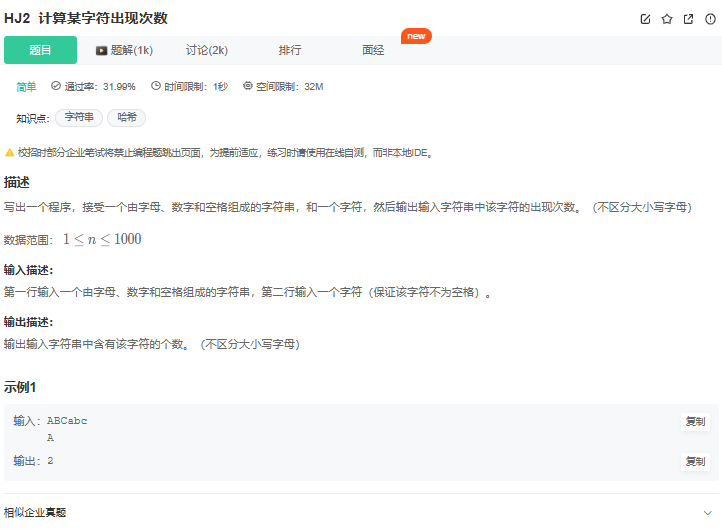

# 题目



## 我的解法

未独立完成，有一个没通过

由于我直接string s,cin>>s， 读到空格就不读取了


```C++
#include <cctype>
#include <iostream>
using namespace std;
#include<string>

int main() {
   string s;
   //getline(cin,s);
   cin>>s;
   cout<<s<<endl;
   char c=getchar();
   int res=0;
   for(int i=0;i<s.size();i++){
        if(tolower(c)==tolower(s[i])){
            res++;
        }
   }
   cout<<res<<endl;
}

```

## 注意点


学会使用getline来读取一行数据，再对数据进行处理。