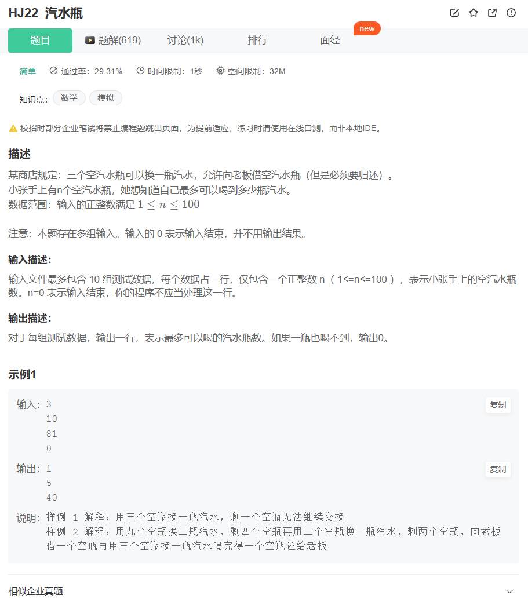

# 题目



# 我的题解


```cpp
#include <iostream>
using namespace std;

int main() {
    int a;
    while(cin>>a&&a!=0){
         int ans=0;
        while(a>=3){
            ans+=a/3;
            a=a/3+a%3;
        }
        if(a==2){
            ans+=1;
        }
        printf("%d\n",ans);
    }
    
    return 0;
}
// 64 位输出请用 printf("%lld")
```


# 其他题解