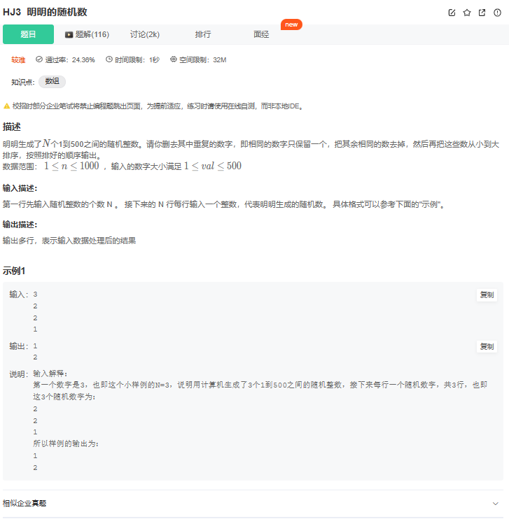

# 题目



# 我的解法

```C++
#include<iostream>
#include<algorithm>
#include<functional>
#include<set>
#include<bits/stdc++.h>
using namespace std;


int main(){
    int n;
    cin>>n;
    set<int> s;
    for(int i=0;i<n;i++){
        int m;
        cin>>m;
        s.insert(m);  //去重      
    }
    //auto cmp=[](int a,int b){
        //return a<b;
    //};

    //sort(s.begin(),s.end(),greater<int>());
    for(const int &i:s)cout<<i<<endl;
    return 0;
}
```

## 注意点：

set是有序集合，不能再使用sort


# 其他解法

```C++
#include<iostream>
#include<vector>
#include<algorithm>
using namespace std;

int main(){
    int n;
    while(cin >> n){ //首先输入每次调查的人数n
        vector<int> v(n);
        for(int i = 0 ; i < n; i++) //连续输入n个整数
            cin >> v[i];
        sort(v.begin(), v.end()); //排序
        for(int i = 0; i < n; i++){ //去重输出
            if(i != 0 && v[i] == v[i - 1])
                continue;
            else
                cout << v[i] << endl;
        }
    }
    return 0;
}

```

