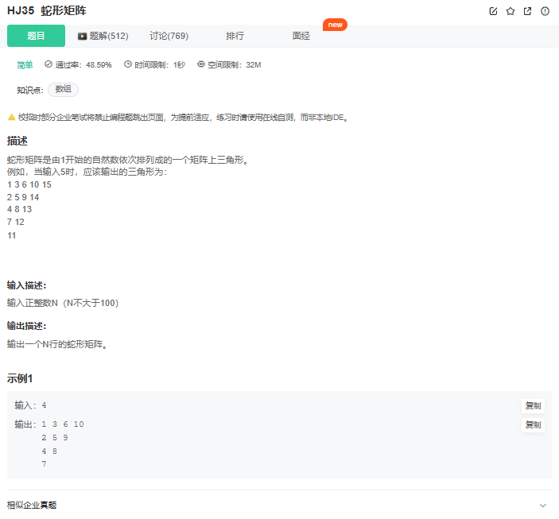
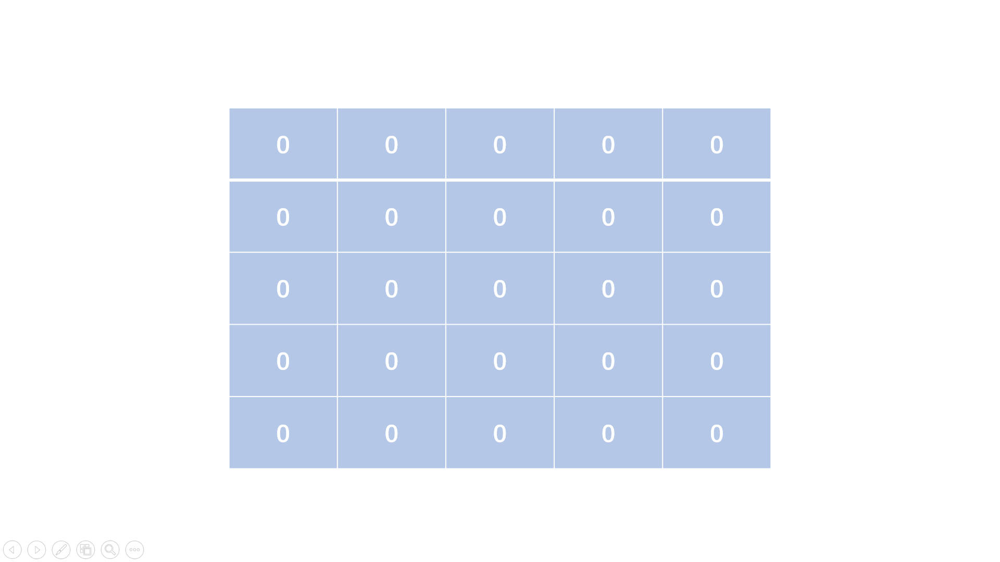
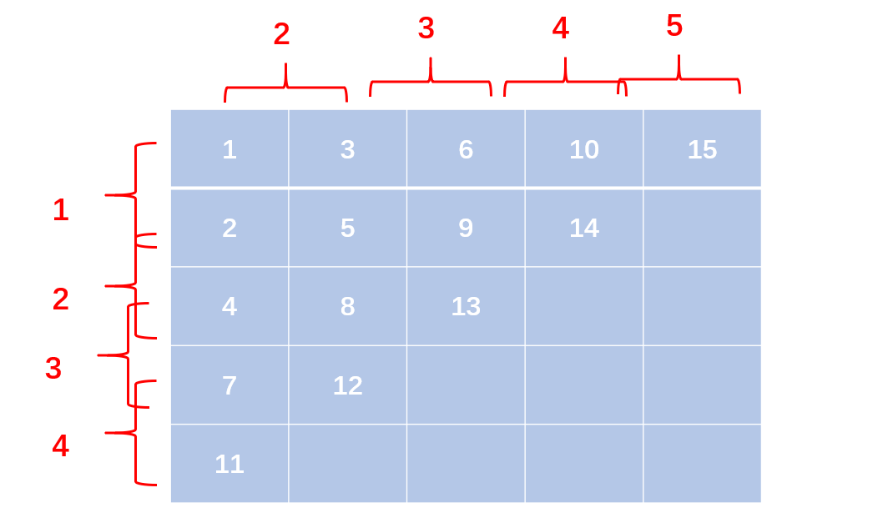

# 题目




# 我的题解

### 非独立完成

```cpp

```


# 其他题解


## 方法一：顺序填表

**具体做法：**

我们可以准备一个�∗�*n*∗*n*的二维矩阵，只填充矩阵上半个三角形，而填充顺序从每行的第一列开始，每次都往右上角方向填充元素，即矩阵行坐标递减，列坐标递增，而填充的数字依次增加就行了。 

然后我们顺序遍历这个矩阵，将非零的元素依次输出即可。

```Cpp
#include<iostream>
#include<vector>
using namespace std;

int main(){
    int n; 
    while(cin >> n){
        vector<vector<int> > matrix(n, vector<int>(n, 0)); //定义一个n*n的矩阵
        int num = 1;
        for(int i = 0; i < n; i++){
            int j = i, k = 0;
            while(j >= 0){
                matrix[j][k] = num; //录入数字
                num++;
                j--; //往右上方移
                k++;
            }
        }
        for(int i = 0; i < n; i++){ //遍历数组每一行
            int j = 0;
            while(matrix[i][j] != 0 && j < n){ //每行只输出前面非零部分
                cout << matrix[i][j] << " ";
                j++;
            }
            cout << endl; //换行
        }
    }
    return 0;
}

```

**复杂度分析：**

- 时间复杂度：�(�2)*O*(*n*2)，填充和输出矩阵都遍历�(�+1)/2*n*(*n*+1)/2个矩阵空间
- 空间复杂度：�(�2)*O*(*n*2)，使用二维矩阵作为辅助数组

## 方法二：数学规律

**具体做法：**

仔细观察这样的蛇形矩阵，我们可以尝试找规律：

对于每一行第一个元素，我们发现2与1之间相差为1，4与2之间相差为2，7与4之间相差为3，11与7之间相差为4，则第�*i*行的第一个元素与它的下一行是相差了个行号（从1开始）。

对于每一行的每个元素，我们发现3与1之间相差为2，6与3之间相差为3，10与6之间相差为4，15与10之间相差为5，则第�*j*列与它的前一列相差为其列号（从1开始）。



有了这个规律，我们遍历这样的上三角形，对每个位置累加出数字即可。

```cpp
#include<iostream>
#include<vector>
using namespace std;

int main(){
    int n; 
    while(cin >> n){
        int k = 1; //起始元素为1
        for(int i = 1; i <= n; i++){ //遍历每一行
            cout << k << " ";  //输出每行首
            int temp = k;
            for(int j = i + 1; j <= n; j++){ //遍历本行的数
                temp += j; //每个数相差为j
                cout << temp << " ";
            }
            cout << endl;
            k += i; //下一行的首为这行首加上这行行号
        }
    }
    return 0;
}

```

**复杂度分析：**

- 时间复杂度：�(�2)*O*(*n*2)，还是要遍历�(�+1)/2*n*(*n*+1)/2个元素
- 空间复杂度：�(1)*O*(1)，无额外空间


观察第一行的规律符合累加求和公式；(n+1)n/2

第二行的规律则是第一行的 ((n+1)n/2) - 1

第三行的规律则是第一行的 ((n+1)n/2) - 2

第四行的规律则是第一行的 ((n+1)n/2) - 3

当i = 1 时，j = 1,2,3,4 进入循环；

当i = 2 时，j = 2,3,4

当i = 3 时，j = 3,4

当i = 4 时，j = 4

```python
n = int(input().strip())
for i in range(1,n+1) :
    for j in range(i,n+1) :
    	# 输出的公式是转化后的，其实也可以写去括号前，int()的作用是将结果转化成整型，因为计算结果是有小数的，end = ' '作用是将内层循环的计算结果以空格隔开
        print(int(((j+j**2)/2)-i+1),end = ' ')
    # 一次循环结束后打印空，用作换行
    print()
```


