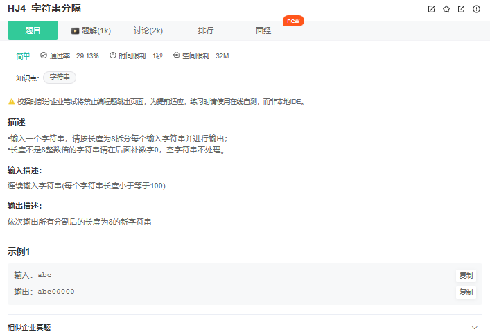

# 题目



# 我的题解

独立完成

思路：

第一部分：

读取完整的字符串，如果字符串的长度大于等于8

startIndex其实每次增长+8 都是到下一个长度为8的字符串的开头

s.size()-startIndex  其实等于 s.size()-1-startIndex+1  还是等于字符串的长度

第二部分：

如果长度已经已经等于0直接结束

如果长度还不等于0但也不大于8，那么就做最后的填充

```cpp
#include<iostream>
#include<string>

using namespace std;

int main(){
    string s;
    getline(cin,s);
    int startIndex=0;
    while(s.size()-startIndex>=8){
        for(int i=startIndex;i<startIndex+8;i++){
            cout<<s[i];
        }
        startIndex+=8;
        cout<<endl;
    }
    //cout<<s.size()<<" "<<startIndex<<endl;
    if(startIndex!=s.size()&&(s.size()-startIndex)<8)
    {
        for(int i=startIndex;i<startIndex+8;i++){
            if(i<s.size()){
                cout<<s[i];
            }
            else{
                cout<<'0';
            }
        }
    }

    return 0;
}
```


# 其他题解

## 思路1：

先对不为8的倍数的字符串结尾补0，使其刚好为8的倍数。然后每隔8个字符输出并打印换行符。

## 代码：

```cpp
#include <iostream>
#include <string>
using namespace std;

int main()
{
    string str;
    while (cin >> str)
    {
        // 补0
        int len = str.size();
        if (len % 8 != 0)
        {
            int count = 8 - len % 8;
            str.append(count, '0');
        }

        // 按格式输出
        int newLen = str.size();
        for (int i = 0; i < newLen; i += 8)
        {
            cout << str.substr(i, 8) << endl;
        }
    }
    return 0;
}
```

## 思路2：

使用输入输出标准库自带的功能。使用cout对象的成员函数width()指定输出域宽，使用成员函数fill()指定填充字符，使用流操纵符left指定左对齐。注意，即使str剩余的字符串长度不足8，str.substr(0, 8)也能正常获取剩余的字符，不会报错。

## 代码：

```cpp
#include <iostream>
#include <string>
using namespace std;

int main()
{
    string str;
    while (cin >> str)
    {
        int len = str.size();
        for (int i = 0; i < len; i += 8)
        {
            cout.width(8);
            cout.fill('0');
            cout << left << str.substr(i, 8) << endl;
        }
    }
    return 0;
}
```