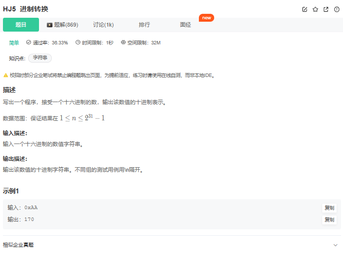

# 题目



# 我的题解

思路：

第一部分 

一定是一个十六进制的数，不需要判断为多少进制

第一部分判断是否为0~9的数字，然后因为我们是从高位到低位计算，那么高位需要乘以16，然后加上低位

这都是套路计算从高位到低位


第二部分：

判断是否是A~F

注意这部分减去A后要加10


```cpp
#include <iostream>
using namespace std;

int main() {
    string a;
    cin>>a;
    int n=a.size();
    int ans=0;
    for(int i=2;i<n;i++){
        if(a[i]>='0'&&a[i]<='9'){
            ans=ans*16+a[i]-'0';
        }
        else ans=ans*16+a[i]-'A'+10;
        //cout<<a[i]<<endl;
        //cout<<ans<<endl;
    }
    cout<<ans<<endl;
}
// 64 位输出请用 printf("%lld")
```


# 其他解法

直接调用atoi  api

```cpp
#include<iostream>
#include<string>
using namespace std;
 
int main(){
    string str;
    while(cin>>str){
        cout << stoi(str,0,16) << endl;
    }
}

```


从最低位开始计算，然后对应的高位上乘以应该的指数

```cpp
#include<iostream>
#include<string>
#include<cmath>
using namespace std;

int main(){
    string s; 
    while(cin >> s){ //连续读取字符串
        int bit = 0; //记录当前位数
        int res = 0;
        for(int i = s.length() - 1; i > 1; i--){
            if(s[i] >= '0' && s[i] <= '9'){
                res += (s[i] - '0') * pow(16, bit); //当前数字乘16的位数次方
                bit++;
            }
            else if(s[i] >= 'A' && s[i] <= 'F'){
                res += (s[i] - 'A' + 10) * pow(16, bit); //字母要转化成数字
                bit++;
            }
        }
        cout << res << endl;
    }
    return 0;
}


```


## 方法二：流输入输出的格式化

**具体做法：**

cin和cout有自己的格式化操作，在输入输出前加hex，表示后续这个是十六进制的数，在输入输出前加dec，表示后续这个是十进制的数，我们可以利用这个原理让输出的变成十六进制数，输出成十进制数。


```cpp
#include<iostream>
using namespace std;

int main(){
    int res = 0;
    while(cin >> hex >> res)  //hex表示读入十六进制数
        cout << dec << res << endl; //dec表示输出十进制数
    return 0;
}


```

**复杂度分析：**

- 时间复杂度：�(1)*O*(1)，无额外时间
- 空间复杂度：�(1)*O*(1)，无额外空间