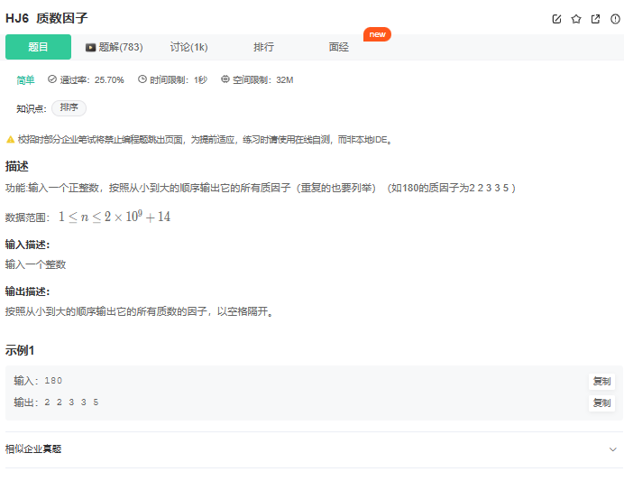
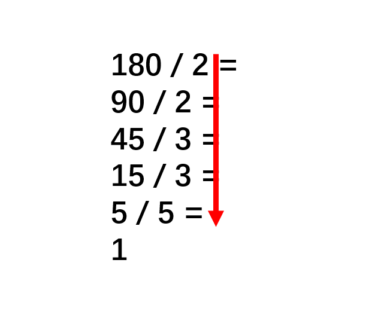

# 题目




# 我的题解

未想出来，如果可能的话，会使用暴力，然后判断是不是该数的因子，关键判断质数不太会


# 其他解法


# 题目的主要信息：

- 输入一个正整数，找出它的全部质数因子（包括重复的）
- 输出所有质因子要从小到大，空格间开，最后一个数后面也要有空格

## 方法一：迭代

**具体做法：**

首先我们要知道三个点：

- 1没有算在这个质因数里面，但是如果这个数本来就是质数，那么它本身就是它的质因数。
- 所有的合数都是由质数相乘得到的，只要一个数把质因数全部除掉，它就不会有合因数了。
- 一个数的质因数不会超过它的算术平方根

那我们可以从2遍历到该数的算术平方根，然后检查是否是因子，如果是则将这个因子全部除尽且输出，再进入下一个。我们最后需要检查这个数本身就是质数的情况，因为在上述过程中它的大小没有变，所以只要它大于1，我们就可以输出这个质数。



```cpp
#include<iostream>
#include<cmath>
using namespace std;

int main(){
    long n;
    cin >> n;
    for(long i = 2; i <= sqrt(n) && i <= n; i++){  //从小到大的质因子，质因子不会超过它的开方
        while(n % i == 0){ //所有的质数前面全部除掉，后续就不会有合因子
            cout << i << " ";
            n /= i; //除掉质因子
        }
    }
    if(n - 1) //自己本身就是质数
        cout << n << " ";
    return 0;
}

```

**复杂度分析：**

- 时间复杂度：�(�)*O*(*n*)，外循环最多循环�*n*次，内循环总共次数不会超过这个数字
- 空间复杂度：�(1)*O*(1)，无额外空间

## 方法二：递归

**具体做法：**

上面方法一的迭代我们也可以用递归解决，每次都从1到当前n的算术平方根，然后不断将n除掉最小的质因子送入到递归中即可。当然，最后也要检查自己是否为质数。


```cpp
#include<iostream>
#include<cmath>
using namespace std;

void recursion(long n){//递归函数
    for(long i = 2; i <= sqrt(n); i++){ //每次遍历到n的开方就行了
        if(n % i == 0){
            cout << i << " ";
            recursion(n / i); //递归解决后续更小的
            return;
        }
    }
    if(n - 1 > 0) //自己就是质数
        cout << n << " ";
}
int main(){
    long n;
    cin >> n;
    recursion(n);
    return 0;
}


```

**复杂度分析：**

- 时间复杂度：�(�)*O*(*n*)，递归中的循环不会超过�(�)*O*(*n*)，递归次数不会超过�(�)*O*(*n*)，总复杂度不会超过�(�)*O*(*n*)
- 空间复杂度：�(�)*O*(*n*)，递归栈最大深度不会超过�*n*


