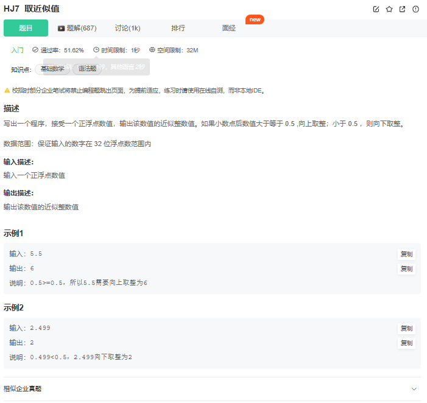

# 题目



# 我的题解

```C++
#include<bits/stdc++.h>

using namespace std;

int main(){
    double n;
    cin>>n;
    double div=n-(long long)n;
    if(div>=0.5){
        cout<<(long long)n + 1<<endl; 
    }
    else {
        cout<<(long long)n <<endl;
    }
    return 0;
}                                                                                        
```


# 其他题解