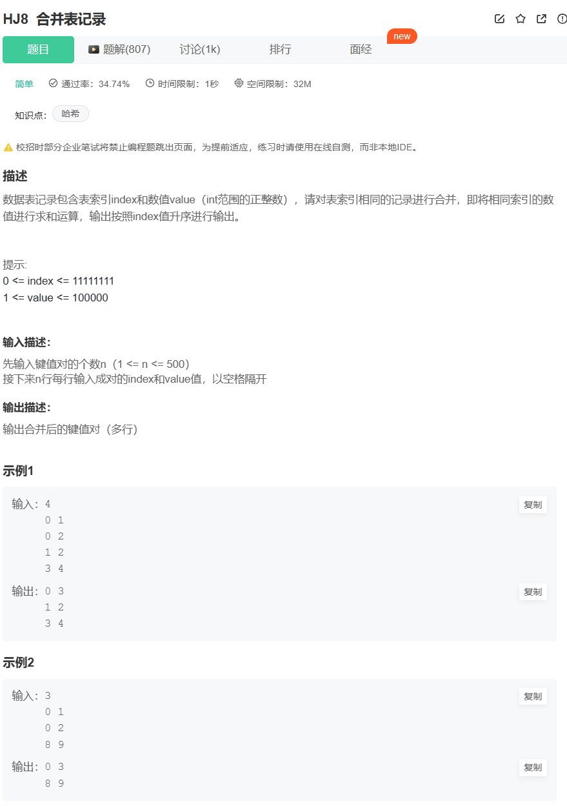

# 题目



# 我的题解

## 思路

### 哈希表法

并且使用map底层是红黑树，是有序的

```cpp
#include<iostream>
#include<map>
using namespace std;


int main(){

    int n;
    cin>>n;
    map<int,int> map;
    for(int i=0;i<n;i++){
        int l,r;
        cin>>l>>r;
        map[l]+=r;
    }
    for(auto &j:map){
        cout<<j.first<<" "<<j.second<<endl;
    }

    return 0;
}
```


# 其他题解

```cpp
#include<iostream>
#include<map>
using namespace std;
int main()
{
    int n;
    map<int,int>m;
    cin>>n;
    while(n--)
    {
        pair<int,int>i;
        cin>>i.first>>i.second;
        m[i.first]+=i.second;
    }
    for(auto i:m)
        cout<<i.first<<' '<<i.second<<endl;
}

```


```cpp
#include<iostream>
#include<map>
using namespace std;

int main()
{
    int n=0;
    cin>>n;
    int key,value;
    map<int, int, less<int>>pairs;
    for(int i=0; i<n; ++i)
    {
        cin>>key>>value;
        if(pairs.count(key)==0)
            pairs.insert(make_pair(key, value));
        else
            pairs[key] += value;
    }
    for(auto it = pairs.begin(); it != pairs.end(); it++)
    {
        cout<<it->first<<' '<<it->second<<endl;
    }
    return 0;
}
```


```cpp
#include<iostream>
#include<map>
using namespace std;
int main() {
    int n;
    cin>>n;    //输入键值对的个数
    map<int, int> m;    //使用map容器，自带键值对数据结构
    map<int, int>::iterator it;    //map类型的迭代器
    for(int i=0;i<n;i++) {
        int a,b;
        cin>>a>>b;        //每行输入一个键值对
        it = m.find(a);    //查找键a是否存在
        if(it != m.end()) {    //如果存在，对键相同的单元的值部分进行求和；
            m[a] = it->second + b;
        }else {        //如果不存在生成新的键值对
            m[a] = b;
        }
    }
    for(it=m.begin();it!=m.end();it++) {    //遍历打印
        cout<<it->first<<" "<<it->second<<endl;
    }
    return 0;
}
```


