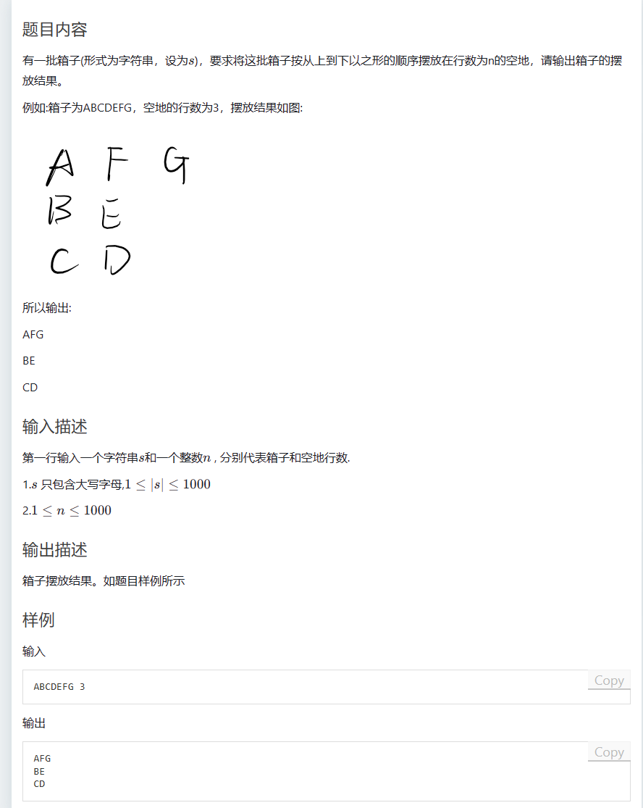

# 题目



# 我的题解


# 其他题解

按照蛇形矩阵的思路做     华为机试HJ35

```cpp
#include <bits/stdc++.h>
using namespace std;
typedef pair<int,int>PII;
#define x first
#define y second
typedef long long ll;
const int N=1010;
int n,m;
char g[N][N];
int dx[4]={1,0,-1,0},dy[4]={0,1,0,1};   //下右上右四个方向循环
int main()
{
    string s;
    cin>>s>>n;
    m=s.size();
    for(int i=0;i<n;i++)
    {
        for(int j=0;j<n;j++)
        {
            g[i][j]=' ';
        }
    }
    int sx=0,sy=0,dirc=0;
    for(int i=0;i<m;i++)
    {
        g[sx][sy]=s[i];
        sx+=dx[dirc];sy+=dy[dirc];
        if(sx==n-1||sx==0)dirc=(dirc+1)%4;   //走到边界 转变方向
    }
    for(int i=0;i<n;i++)
    {
        for(int j=0;j<n;j++)
        cout<<g[i][j];
        cout<<endl;
    }
    return 0;
}

```

