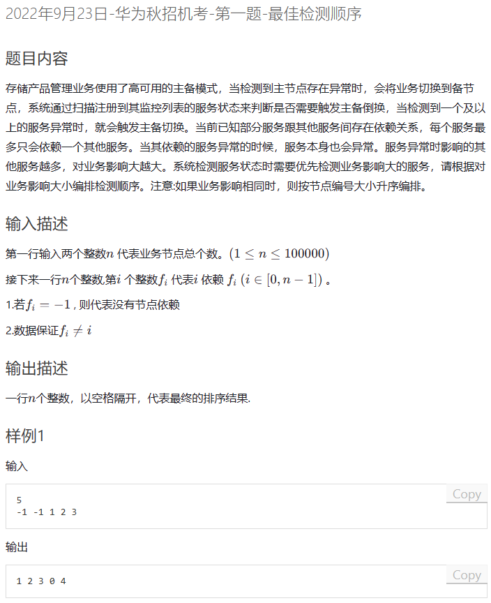

# 题目

涉及图，树，排序，dfs 




# 我的题解

我的理解是  第i个整数fi  代表i依赖fi

说明当前下标i依赖fi,当然 下标i和fi都是整数，如果一个整数被其他整数依赖多次，那么就说明它的影响大


非独立完成

```C++
#include<bits/stdc++.h>

using namespace std;


int main(){

    int n;
    cin>>n;
    vector<int> depends(n,-1);
     vector<pair<int,int>> affects;
    for(int i=0;i<n;i++){
        int m;
        cin>>m;
        depends[i]=m;
        affects.emplace_back(i,1);
        //affects[].first是序号,也代表要去依赖他人的数字，second代表影响力
    }
    /*
    unordered_map<int,int> map;
    for(int i=0;i<n;i++){
        map[depends[i]]++;
    }
    for(auto &i:map){
        affects.push_back({i.first,i.second});
    }
    */
    //找到i的依赖
    for(int i=0;i<n;i++){
        int depend=depends[i];
        //没怎么看懂
        while(depend!=-1){
            affects[depend].second++;
            depend = depends[depend];
        }
    }

    auto cmp =[](pair<int,int>&a ,pair<int,int>&b){
        return a.second>b.second || (a.second==b.second && a.first<b.first);
    };
    sort(affects.begin(),affects.end(),cmp);
    for(int i=0;i<n;i++){
        cout<<affects[i].first;
        if(i!=n-1)cout<<" ";
    }
    return 0;

}
```


# 其他人题解

用到了dfs

chatgpt思路:

这份代码也是一种可行的解法。它通过 DFS 遍历每个节点及其子节点，计算出每个节点对应的子树大小（即服务对业务的影响大小），并将结果存储在 `dp` 数组中。然后通过对节点的子树大小和编号进行排序，即可得到所求的服务检测顺序。

这份代码的时间复杂度为 $O(n \log n)$，其中排序的时间复杂度为 $O(n \log n)$，而 DFS 遍历的时间复杂度为 $O(n)$。空间复杂度为 $O(n)$，其中 `dp` 数组的空间复杂度为 $O(n)$，而邻接表的空间复杂度为 $O(m)$，其中 $m$ 为边数，$m \leq n$，因此总的空间复杂度为 $O(n)$。

相比起另一份代码，这份代码更容易理解，且代码量更少。但是它需要进行两次遍历，其中一次是 DFS 遍历，时间复杂度为 $O(n)$，而另一次是对节点的子树大小进行排序，时间复杂度为 $O(n \log n)$，因此总的时间复杂度为 $O(n \log n)$。另一份代码只需要进行一次遍历，并且在遍历的过程中就可以计算出每个节点的影响大小，并且使用了优先队列进行优化，因此在实际的运行时间上可能会更快一些。

```C++
#include <bits/stdc++.h>
using namespace std;

const int maxn = 1e5 + 5;
vector<int> g[maxn], dp(maxn, -1);


void dfs(int u) {
    if (dp[u] != -1) return;
    dp[u] = 1;
    for (int v : g[u]) {
        dfs(v);
        dp[u] += dp[v];
    }
}

int main() {
    int n, fi; cin >> n;
    for (int i = 0; i < n; ++i) {
        cin >> fi;
        if (fi == -1) continue;
        g[fi].push_back(i);
    }
    for (int i = 0; i < n; ++i) {
        dfs(i);
    }
    int ids[n];
    iota(ids, ids + n, 0);
    sort(ids, ids + n, [&](int i, int j) {
        return dp[i] != dp[j] ? dp[i] > dp[j] : i < j;
    });
    for (int idx : ids) {
        printf("%d ", idx);
    }
    return 0;
}
```


与我题解思路，前面一直，但是转化没看懂

chatgpt思路：

这份代码和之前的代码思路不同，它是先遍历所有节点，统计每个节点的影响因子，然后根据影响因子排序输出。具体来说，对于每个节点 $i$，统计依赖节点的影响因子，将依赖节点的影响因子加到 $i$ 的影响因子上，最终得到 $i$ 的总影响因子。然后将节点编号和影响因子打包成一个 pair，根据影响因子排序输出即可。

这份代码的时间复杂度为 $O(n\log n)$，其中 $n$ 是节点个数，和之前的代码相比，它遍历了所有节点，因此在节点数量较少的情况下，效率可能稍低一些。

```C++
#include<bits/stdc++.h>
using namespace std;


bool cmp(pair<int, int>&a, pair<int, int>&b){
    return a.second>b.second || (a.second==b.second && a.first<b.first);
}

int main(){
    int n;
    cin>>n;
    vector<int> depends = vector<int>(n, -1);
    vector<pair<int, int>> affects;
    for(int i=0;i<n;i++){
        int d;
        cin>>d;
        depends[i] = d;
        affects.emplace_back(i,1);
    }
    for(int i=0;i<n;i++){
        int depend = depends[i];
        while(depend!=-1){
            affects[depend].second++;
            depend = depends[depend];
        }
    }
    sort(affects.begin(), affects.end(),cmp);
    for(int i=0;i<n;i++){
        cout<<affects[i].first;
        if(i!=n-1){
            cout<<" ";
        }
    }
}
```


### 塔子哥解法

1.子树结点越多，结点影响越大。

2.影响相同的情况下，编号小的排前面

知道这两点了以后，就直接dfs一下求每个点的子树个数。然后对结点按子树个数降序排序。相同按编号升序排

## 代码

C++代码

```cpp
#include <bits/stdc++.h>
using namespace std;
const int N = 1e5 + 10;
int n;
int fa[N];				//节点i的父节点
vector<int> e[N];		//节点i的子节点
int cnt[N];				//节点i的子树中的节点个数
int dfs(int s)		//计算s的 子树中的节点个数
{
	cnt[s] = 1;		//s本身
	for(int g: e[s])	//遍历s的每个子节点
	{
		cnt[s] += dfs(g);	//递归计算每个子节点的子树的节点个数，然后加到s上
	}
	return cnt[s];		//返回s的子树的节点个数
}
int ans[N];
bool cmp(int &x, int &y) {		//重写排序函数，按照子树中节点个数排序，相等时按大小排序
	if(cnt[x] == cnt[y]) return x < y;
	return cnt[x] > cnt[y];
}
int main()
{
	cin >> n;
	for(int i = 0 ; i < n ; i++) {
		cin >> fa[i];		//输入i的父节点
		if(fa[i] != -1) {		//-1代表i没有父节点，此时i为一棵树的根节点
			e[fa[i]].push_back(i);	//添加到父节点的子节点集合中
		}
	}
	for(int i = 0 ; i < n ; i++) {
		ans[i] = i;		//顺便初始化一下排序的值
		if(fa[i] == -1)	//i为一棵树的根节点，从这个点开始遍历
            dfs(i);
	}
	sort(ans, ans+n, cmp);	//排序
	for(int i = 0 ; i < n ; i ++) {
		cout << ans[i] << " \n"[i+1==n];	//输出，" \n"[i+1==n]代表最后一次输出回车，前面输出空格分割
	}
}
```