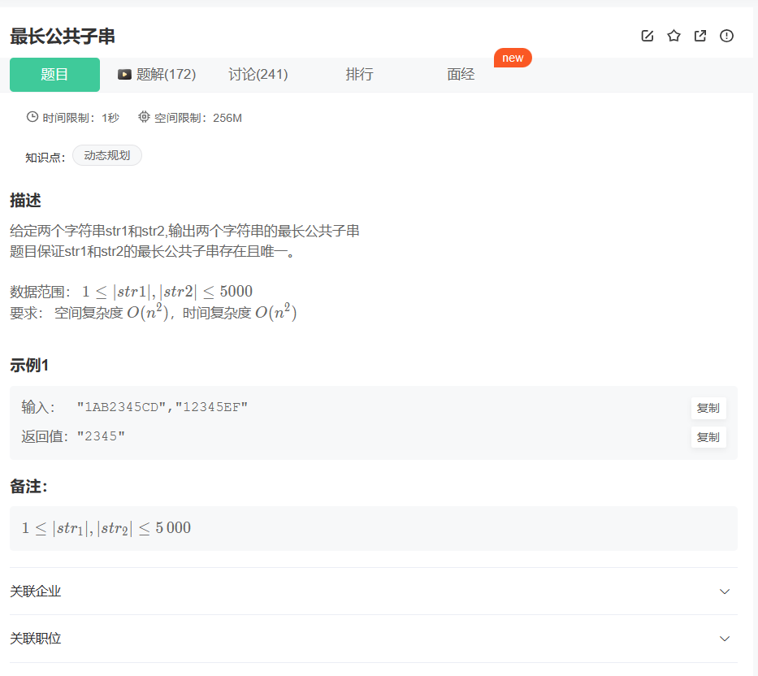
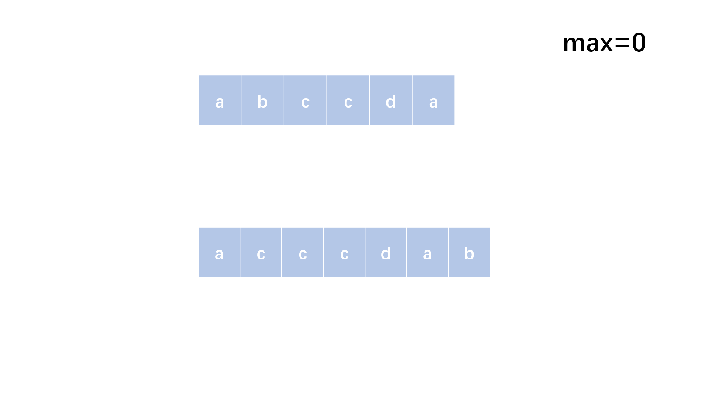
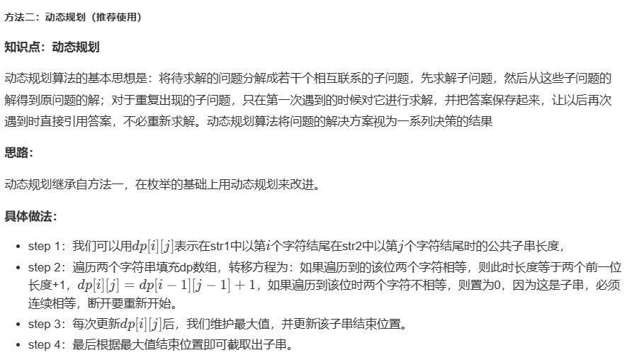

# 题目



## 我的题解


## 其他题解

##### 方法一：枚举（前置方法，超时，不能完全通过）

**思路：**

最简单直观的方式大概就是枚举了，枚举所有的子串进行比较，但是太复杂了。其实找子串不用一样完全枚举，还可以尝试改良一下

**具体做法：**

- step 1：我们完全可以遍历两个字符串的所有字符串作为起始
- step 2：然后同时开始检查字符是否相等，相等则不断后移，增加子串长度，如果不等说明以这两个为起点的子串截止了，不会再有了。
- step 3：后续比较长度维护最大值即可。

**图示：**




```cpp
class Solution {
public:
    string LCS(string str1, string str2) {
        int length = 0;
        string res = ""; 
        //遍历s1每个起始点
        for(int i = 0; i < str1.length(); i++){ 
            //遍历s2每个起点
            for(int j = 0; j < str2.length(); j++){ 
                int temp = 0;
                string temps = "";
                int x = i, y = j;
                //比较每个起点为始的子串
                while(x < str1.length() && y < str2.length() && str1[x] == str2[y]){ 
                    temps += str1[x];
                    x++;
                    y++;
                    temp++;
                }
                //更新更大的长度子串
                if(length < temp){ 
                    length = temp;
                    res = temps;
                }
            }
        }
        return res;
    }
};

```





```cpp
class Solution {
public:
    string LCS(string str1, string str2) {
        //dp[i][j]表示到str1第i个个到str2第j个为止的公共子串长度
        vector<vector<int> > dp(str1.length() + 1, vector<int>(str2.length() + 1, 0)); 
        int max = 0;
        int pos = 0;
        for(int i = 1; i <= str1.length(); i++){
            for(int j = 1; j <= str2.length(); j++){
                //如果该两位相同
                if(str1[i - 1] == str2[j - 1]){ 
                    //则增加长度
                    dp[i][j] = dp[i - 1][j - 1] + 1; 
                }
                else{ 
                    //该位置为0
                    dp[i][j] = 0; 
                }
                //更新最大长度
                if(dp[i][j] > max){ 
                    max = dp[i][j];
                    pos = i - 1;
                }
            }
        }
        return str1.substr(pos - max + 1, max);
    }
};

```


