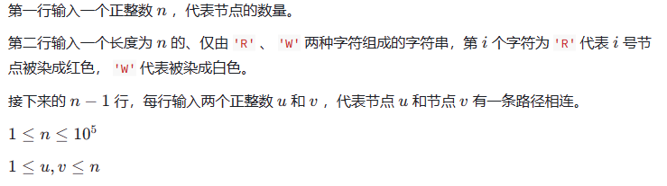

# 题目内容

小红拿到了一棵树，树上已经有一些点被染成了红色，另一些点被染成了的白色。

小红可以进行若干次如下操作：

选择一个点，改变它的染色状态（红色变白色或者白色变红色）

小红想知道，至少需要多少次操作，可以使得任意相邻两点的颜色不同？

# 输入描述



# 输出描述

一个整数，代表最小的操作次数。

# 样例

**输入**

```none
4
RWWW
1 2
2 3
2 4
```

**输出**

```none
2
```


**样例解释**

对 11 号和 22 号节点各操作一次即可。


